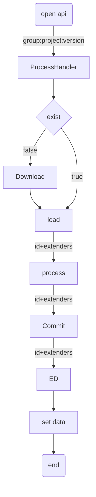

# 插件修改

```mermaid
graph TD
Start(open api)-->|group:project:version|P[ProcessHandler]
P-->H{exist}
H-->|false|D[Download]
D-->LD
H-->|true|LD[load]
LD-->|id+extenders|RP[process]
RP-->|id+extenders|Commit
Commit-->|id+extenders|ED
ED-->Data[set data]
Data-->End(end)

```

