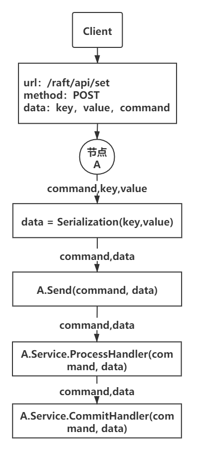
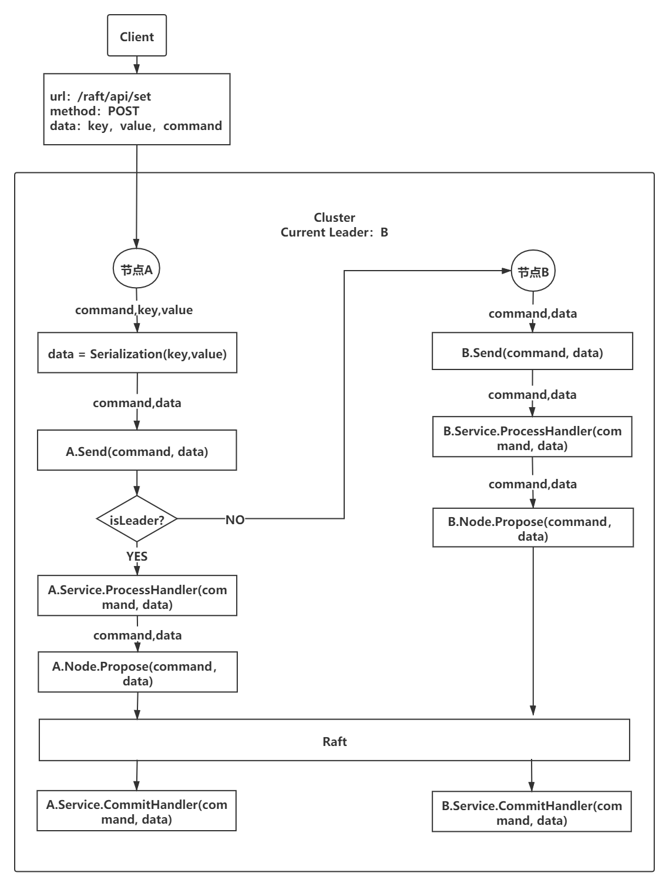

# Quick Start

## 参数说明

- **httpPort**：节点对外向客户端提供API的端口
- **nodeID**：节点id，集群中唯一，第一个节点id默认为1
- **host**：节点地址`ip:port`，节点运行地址，也是节点间进行信息通信的地址
- **isCluster**：是否开启集群模式，非集群模式下的节点在其他节点选择加入的情况下会自动切换到集群模式
- **peers**：peer列表，以逗号(,)分割，非集群模式下可为空
- **keys**： **peers**参数对应的节点id列表，以逗号(,)分割，非集群模式下可为空
- **join**：是否选择加入一个新集群，非集群模式下可为空
- **target**：目标集群节点地址，**join**为true时不能为空

## IService接口说明

- ```go
  // CommitHandler 集群节点commit信息前的处理
  CommitHandler(cmd string, data []byte)  (err error)
  ```

- ```go
  // ProcessHandler 集群节点propose信息前的处理，一般情况下由leader节点调用
  ProcessHandler(command string, propose []byte) (cmd string, data []byte, err error)
  ```

- ```go
  // GetInit 集群初始化时的将service缓存中的信息进行打包处理,只会在节点切换集群模式的时候调用一次
  GetInit() (cmd string, data []byte, err error)
  ```

- ```go
  // ResetSnap 读取快照数据，用于恢复service
  ResetSnap(data []byte) (err error)
  ```

- ```go
  // GetSnapshot 生成快照，用于快照文件的生成
  GetSnapshot() (data []byte, err error)
  ```

#### Demo实现

```go
// Service Demo 
type service struct {
   store map[string]string
   mutex       sync.RWMutex
}

// KV 用于数据传输的结构
type KV struct {
   Key string
   Value string
}

// 新建service demo
func Create() *service {
   return &service{
      store: make(map[string]string),
      mutex: sync.RWMutex{},
   }
}

func (s *service) CommitHandler(cmd string, data []byte) (err error) {
   // TODO: process the command
   s.mutex.Lock()
   defer s.mutex.Unlock()
   switch cmd {
   case "set":
      kv := &KV{}
      err = json.Unmarshal(data, kv)
      s.store[kv.Key] = kv.Value
      return err
   case "init":
      return nil
   }
   return nil
}

func (s *service) ProcessHandler(command string, propose []byte) (cmd string, data []byte, err error) {
   // TODO: process the command before sending the message
   kv := &KV{}
   kv.Decode(propose)
   kv.Value = kv.Value + string(time.Now().UnixNano())
   data, err = json.Marshal(kv)
   command = "set"
   return command, data, err
}

func (s *service) GetInit() (cmd string, data []byte, err error) {
   s.mutex.RLock()
   defer s.mutex.RUnlock()
   cmd = "init"
   data, err = json.Marshal(s.store)
   return cmd, data, err
}

func (s *service) ResetSnap(data []byte) error  {
   s.mutex.Lock()
   defer s.mutex.Unlock()
   store := make(map[string]string)
   json.Unmarshal(data, &store)
   s.store = store
   return nil
}

func (s *service) GetSnapshot() ([]byte, error) {
   s.mutex.RLock()
   defer s.mutex.RUnlock()
   return json.Marshal(s.store)
}

func (kv *KV) Encode() ([]byte, error) {
   var buf bytes.Buffer
   if err := gob.NewEncoder(&buf).Encode(kv); err != nil {
      return nil, err
   }
   return buf.Bytes(), nil
}

func (kv *KV) Decode(data []byte) error {
   dec := gob.NewDecoder(bytes.NewBuffer(data))
   if err := dec.Decode(kv); err != nil {
      return err
   }
   return nil
}
```

## 开启一个非集群节点

```go
// 基础参数设置
// 客户端接口请求端口
httpPort := 8081
// 第一个节点id默认为1
nodeID := 1
// 非集群模式
isCluster := false
// 当isCluster为false时，join需为false
join := false
// 当前节点地址
host := "http://127.0.0.1:1234"
// peer列表，非集群模式下仅有一个peer仅有节点本身
peers := "http://127.0.0.1:1234"
// peer对应的的id列表
keys := "1"
// 初始化服务，该服务已经实现了IService interface
var s = Create()
var raft = &raftNode{}
// 新建raft节点
raft, err = CreateRaftNode(nodeID, host, s, peers, keys, join, isCluster)
if err != nil {
    log.Fatal(err)
}
client := &RaftClient{
    raft: raft,
}
// 开启客户端http对外服务，主要提供了往集群中添加信息，增加节点，删除节点的对外接口，通过客户端接口可以实现节点间信息的同步
// 开发者也可以结合自己的实际需求开放针对service的其他服务
httpServer := http.NewServeMux()
httpServer.Handle("/raft/api/", client.Handler())
log.Info(fmt.Sprintf("Listen http port %d successfully", httpPort))
log.Fatal(http.ListenAndServe(fmt.Sprintf(":%d", httpPort), httpServer))
```

####  CreateRaftNode函数说明

```go
// CreateRaftNode 初始化节点
// 1、创建非集群节点,isCluster为false，此时peers可为空
// 2、创建集群节点，isCluster为true，若此时peers为空(或仅有节点本身)，表示该集群仅有一个节点
// peers也可以是其余集群中的其他节点，表示这是一个多节点集群，此时其他节点也需通过同样的参数配置和方式启动，
// 推荐使用JoinCluster来新建多节点集群节点
// 3、创建加入已知集群的节点，join为true，isCluster为true，此时peers需包括其他节点地址，推荐使用JoinCluster来新建非单点集群节点
// 一般情况下，如果join为true，isCluster也默认为true
func CreateRaftNode(id int, host string, service IService, peers string, keys string, join bool, isCluster bool) (*raftNode, error)
```

## 新建节点并加入一个集群

```go
// 客户端接口请求端口
httpPort := 8082
// 选择加入集群
join := true
// 当前节点ip
host := "http://127.0.0.1:2234"
// 目标集群的已知地址，如果target本身为非集群节点，则会先建立集群，再新建本节点
target := "http://127.0.0.1:1234"
// 初始化服务，该服务已经实现了IService interface
var s = Create()
var raft = &raftNode{}
// 新建raft节点,加入一个已知集群
raft, err = JoinCluster(host, target, s)
if err != nil {
    log.Fatal(err)
}
client := &RaftClient{
    raft: raft,
}
httpServer := http.NewServeMux()
httpServer.Handle("/raft/api/", client.Handler())
log.Info(fmt.Sprintf("Listen http port %d successfully", httpPort))
log.Fatal(http.ListenAndServe(fmt.Sprintf(":%d", httpPort), httpServer))
```

#### JoinCluster函数说明

```go
// JoinCluster 新建一个加入已知集群的节点
// 1、应用于新建一个想要加入已知集群的节点，会向已知节点发送请求以获取节点id等新建节点信息
// 已知节点如果还处于非集群模式，会先切换成集群模式
// 2、也可以用于节点crash后的重启处理
func JoinCluster(local string, target string, service IService) (*raftNode, error) 
```

## 客户端接口说明

- **/raft/api/set**
  - 请求方法：POST
  - 接口描述：往集群中新增信息
  - 请求参数：json类型，开发者结合自己的实际需求规定，demo中模拟了一个kv数据库存储，使用的结构是一个kv结构，因此demo中的参数为想要在节点间同步的key，value
- **/raft/api/addNode**
  - 请求方法：POST
  - 接口描述：往集群中新增节点，基于api新增的节点，需要另外通过CreateRaftNode方式新建一个指定id的节点
  - 参数类型：JSON
  - 请求参数：节点Id和节点地址host
- **/raft/api/deleteNode**
  - 请求方法：POST
  - 接口描述：删除集群中的已有节点
  - 参数类型：JSON
  - 请求参数：节点Id
- **/raft/api/getPeerList**
  - 请求方法：GET
  - 接口描述：获取集群中已有的节点列表

## 相关流程图说明

#### 往节点中新增信息(即调用/raft/api/set)

- **节点处于非集群模式**

  

- **节点处于集群模式**

  

- 
